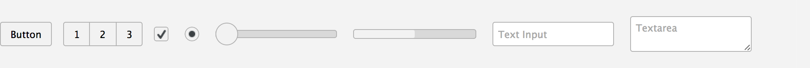

---

layout: docs
title: Matte - MontageJS Theme

prev-page: theme-digit-components
this-page: theme-matte-components
next-page: theme-native-components

---


# Matte Theme

Matte is a basic, neutral-looking theme for HTML5 controls and inputs. You can use it as a wireframe for prototypes or starting point for creating your own custom theme.



## Available Components
The following list summarizes the UI components that are currently part of the Matte widget set:

Component | Description
------------ | -------------
<a href="https://github.com/montagejs/matte/tree/master/ui/anchor.reel" target="_blank">Anchor</a> | Provides hyperlink functionality.
<a href="https://github.com/montagejs/matte/tree/master/ui/autocomplete" target="_blank">Autocomplete</a> | Provides suggestions while you type into a field.
<a href="https://github.com/montagejs/matte/tree/master/ui/button.reel" target="_blank">Button</a> | Provides button functionality.
<a href="https://github.com/montagejs/matte/tree/master/ui/component-group.reel" target="_blank">ComponentGroup</a> | 
<a href="https://github.com/montagejs/matte/tree/master/ui/dynamic-element.reel" target="_blank">DynamicElement</a> | Lets you append a string of markup to a page.
<a href="https://github.com/montagejs/matte/tree/master/ui/image.reel" target="_blank">Image</a> | Provides functionality for displaying an image.
<a href="https://github.com/montagejs/matte/tree/master/ui/input-checkbox.reel" target="_blank">InputCheckbox</a> | Provides checkbox functionality.
<a href="https://github.com/montagejs/matte/tree/master/ui/input-date.reel" target="_blank">InputDate</a> | Provides date functionality.
<a href="https://github.com/montagejs/matte/tree/master/ui/input-number.reel" target="_blank">InputNumber</a> | Provides functionality for entering a number in a text field. This typically includes a spinner control attached to the text field.
<a href="https://github.com/montagejs/matte/tree/master/ui/input-range.reel" target="_blank">InputRange</a> | Provides slider functionality.
<a href="https://github.com/montagejs/matte/tree/master/ui/input-text.reel" target="_blank">InputText</a> | Provides functionality for a single-line text field.
<a href="https://github.com/montagejs/matte/tree/master/ui/list.reel" target="_blank">List</a> | Provides list functionality.
<a href="https://github.com/montagejs/matte/tree/master/ui/loading-panel.reel" target="_blank">LoadingPanel</a> | Displays status of a determinate or indeterminate process.
<a href="https://github.com/montagejs/matte/tree/master/ui/loading.reel" target="_blank">Loading</a> | Shows loading in progress indicator.
<a href="https://github.com/montagejs/matte/tree/master/ui/popup" target="_blank">Popup</a> | (Deprecated in favor of the new Overlay component.)
<a href="https://github.com/montagejs/matte/tree/master/ui/progress.reel" target="_blank">Progress</a> | Provides progress bar functionality.
<a href="https://github.com/montagejs/matte/tree/master/ui/radio-button.reel" target="_blank">RadioButton</a> | Provides radio button functionality.
<a href="https://github.com/montagejs/matte/tree/master/ui/rich-text-editor" target="_blank">RichTextEditor</a> | Provides functioanlity for text entry and styling.
<a href="https://github.com/montagejs/matte/tree/master/ui/scroll-bars.reel" target="_blank">ScrollBars</a> | Provides scrollbar functionality.
<a href="https://github.com/montagejs/matte/tree/master/ui/scroller.reel" target="_blank">Scroller</a> | Adds scollbars if there is too much content.
<a href="https://github.com/montagejs/matte/tree/master/ui/select.reel" target="_blank">Select</a> | Provides drop-down list functionality in Montage.
<a href="https://github.com/montagejs/matte/tree/master/ui/textarea.reel" target="_blank">TextArea</a> | Provides functionality for a multiline text field.
<a href="https://github.com/montagejs/matte/tree/master/ui/text-input.js" target="_blank">TextInput</a> | Provides functionality for a singleline text field.
<a href="https://github.com/montagejs/matte/tree/master/ui/text-slider.reel" target="_blank">TextSlider</a> | Adds a numeric slider.
<a href="https://github.com/montagejs/matte/tree/master/ui/toggle-button.reel" target="_blank">ToggleButton</a> | Provides on/off button functionality.
<a href="https://github.com/montagejs/matte/tree/master/ui/toggle-switch.reel" target="_blank">ToggleSwitch</a> | Provides on/off functionality.
<a href="https://github.com/montagejs/matte/tree/master/ui/token-field" target="_blank">TokenField</a> | Adds text input for multiple items (e.g., tag list or to field in emails).
<a href="https://github.com/montagejs/matte/tree/master/ui/video-player.reel" target="_blank">VideoPlayer</a> | Provides basic video controls.


## Installing the Matte Theme

Matte is not included in the default application template. To use Matte in your projects, you have to install it first:

1. Use your command line tool to switch to your project directory.

    ```
    cd yourprojectfolder
    ```
    
2. At the prompt, enter:

    ```
    npm install matte@latest --save
    ```
    
    The `--save` flag ensures that the matte package is automatically added as a dependency to the package.json file of your application code.
