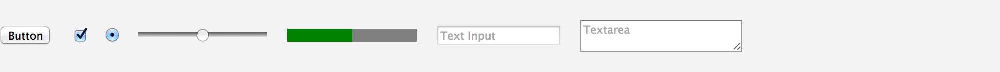

---

layout: docs
title: Native - MontageJS Theme

prev-page: theme-matte-components
this-page: theme-native-components

---


# Native Theme

The Native set uses the browser's default styles. Use this set if you want to custom design your user interface components yet still gain access to MontageJS features such as data binding and the MontageJS event handling model.



## Benefits
MontageJS native components support the same powerful binding and event listener models as the Digit and Matte themes. They also have the following benefits:

* **Smaller footprint**: Custom components often include a number of elements to achieve the desired styling. In addition to the extra markup, the additional component CSS also has to be downloaded.

* **Easier styling**: If you would like to adjust the look and feel of custom components to either fit a different theme or be optimized for typical desktop-style applications, you have to download the component CSS and then add additional styles to override and build upon the current styles. With native components you only have to override the default user-agent/browser styles.

## Available Components
The following list summarizes the UI components that are currently part of the Native widget set:

Component | Description
------------ | -------------
<a href="https://github.com/montagejs/native/tree/master/ui/anchor.reel" target="_blank">Anchor</a> | Provides hyperlink functionality. It acts as a wrapper around the `a` element.
<a href="https://github.com/montagejs/native/tree/master/ui/button.reel" target="_blank">Button</a> | Provides button functionality. It wraps either a `button` element or an `input` element with type of `button`.
<a href="https://github.com/montagejs/native/tree/master/ui/image.reel" target="_blank">Image</a> | Provides functionality for displaying an image. It wraps the `img` element.
<a href="https://github.com/montagejs/native/tree/master/ui/input-checkbox.reel" target="_blank">InputCheckbox</a> | Provides checkbox functionality. It wraps an `input` element with type of `checkbox`.
<a href="https://github.com/montagejs/native/tree/master/ui/input-date.reel" target="_blank">InputDate</a> | Provides date functionality. It wraps a `input` element with type of `date`.
<a href="https://github.com/montagejs/native/tree/master/ui/input-number.reel" target="_blank">InputNumber</a> | Provides functionality for entering a number in a text field. This typically includes a spinner control attached to the text field. It wraps the `input` element with type of `number`.
<a href="https://github.com/montagejs/native/tree/master/ui/input-radio.reel" target="_blank">InputRadio</a> | Provides radio button functionality. It wraps the `input` element with type of `radio`.
<a href="https://github.com/montagejs/native/tree/master/ui/input-range.reel" target="_blank">InputRange</a> | Provides slider functionality. It wraps the `input` element with type of `range`.
<a href="https://github.com/montagejs/native/tree/master/ui/input-text.reel" target="_blank">InputText</a> | Provides functionality for a single-line text field. It wraps the `input` element with a type of `text`.
<a href="https://github.com/montagejs/native/tree/master/ui/progress.reel" target="_blank">Progress</a> | Provides progress bar functionality. It wraps the `progress` element.
<a href="https://github.com/montagejs/native/tree/master/ui/select.reel" target="_blank">Select</a> | Provides drop-down list functionality in MontageJS. It wraps the `input` element with type of `select`.
<a href="https://github.com/montagejs/native/tree/master/ui/textarea.reel" target="_blank">TextArea</a> | Provides functionality for a multiline text field. It wraps the `textarea` element.


## Installing the Native Theme

The Native set is not included in the default project template. To use the Native components in your project, you have to install the set first:

1. Open a Terminal window and switch to your project directory.

    ```
    cd yourprojectfolder
    ```
    
2. At the prompt enter:

    ```
    $ npm install native@latest --save
    ```
    
    The `--save` flag ensures that the native package is automatically added as a dependency to the package.json file of your application code.

## Using the Native Theme

You can use Native components in almost the same way as the Digit and Matte components. The main differences are: you will have to provide the styling yourself and you need to specify the actual element in your HTML file, rather than using a placeholder element. The hooks for adding the serialization and so on are the same.

For example, here is an HTML button hooked up as a Button component:

**HTML body**

```html
<button data-montage-id="button">I'm a native button</button>
```

**Serialization**

```json
"button": {
    "prototype": "native/ui/button.reel",
    "properties": {
        "element": { "#": "button"}
    }
}
```

### Using Bindings
The following example adds a range slider that is hooked up to an InputRange component, and an empty `output` element, which is hooked up to a Text component. The Text component is bound to the slider and its value is set to be the value of the slider. If you move the slider you will see that the value is put into the output element and kept in sync. The slider value is initially set to 0 as the bindings are two-way and the Text component initializes it as 0.

**HTML body**

```html
<h1>Pump up the volume</h1>
<form>
    <label for="slider1">Volume</label>
    <input type="range" data-montage-id="slider1" min="0" max="11"/>
    <output for="slider1" data-montage-id="volume"></output>
</form>
```

**Serialization**

```json
    "slider": {
        "module": "native/ui/input-range.reel",
        "name": "InputRange",
        "properties": {
            "element": {"#": "slider1"}
        },
    "bindings": {
        "value": {"<->": "@output.value"}
        },
    "output": {
        "module": "native/ui/text.reel",
        "name": "Text",
        "properties": {
            "element": {"#": "volume"},
            "value": 0
         }
    }
```

## Native Component State
In the example above two attributes are set on the slider: `min` and `max`. These attributes map to the `min` and `max` properties of the InputRange component. All nondeprecated standard attributes map in this way to a component property. This includes <a href="http://dev.w3.org/html5/markup/global-attributes.html" target="_blank">global attributes</a> as well as attributes specific to each element. All of these properties can be used in bindings.

As these two attributes were specified in the original HTML (rather than with a script later), they are available at serialization time and thus the values are stored in their equivalent MontageJS properties.

If the attributes are updated later, after serialization takes place, the new values will not be synced with the MontageJS properties and the model and view will get out of sync. To avoid expensive reflow, it is better to update the component properties directly, rather than mutating the DOM, as this will keep things in sync. This potentially also gives you performance gains as DOM manipulation can be performance sensitive, and MontageJS can optimize how it interacts with the DOM.

The following example shows how to set the `min` and `max` properties in the serialization rather than using attributes in the HTML. In this particular case adding via HTML would be fine as they're added before serialization happens, but it is worth showing how to set it in this manor.

In this example the HTML stays the same, except the range slider:

```html
<input type="range" data-montage-id="testSlider"/>
```

Then the properties section of the slider serialization is updated to add the two new min and max properties:

```json
…
"slider": {
    "module": "native/ui/input-range.reel",
    "name": "InputRange",
    "properties": {
        "element": {"#": "testSlider"},
        "min": 5,
        "max": 20
    },
…
```

## Handling Events
As shown above, using bindings with Native components works them same using bindings with Digit and Matte components. This also holds true for handling events. As such I wont talk about it here, but you can view our [documentation](http://montagejs.org/docs/event-handling.html) on events. If you follow the instructions there it will also work with your native components.
